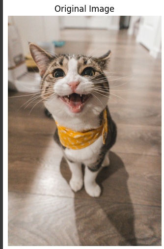
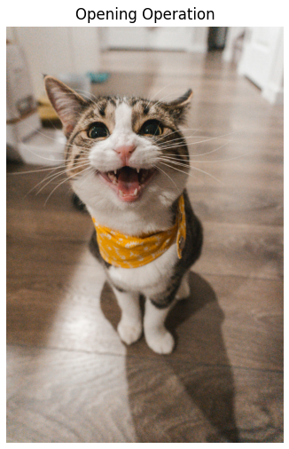
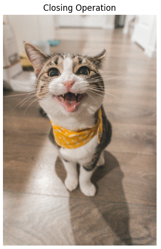

# OPENING--AND-CLOSING
## Aim
To implement Opening and Closing using Python and OpenCV.

## Software Required
1. Anaconda - Python 3.7
2. OpenCV

## Algorithm:
### Step1:
Import the necessary packages

### Step2:
Create the Text using cv2.putText

### Step3:
Create the structuring element

### Step4:
Use Opening operation

### Step5:
Use Closing Operation

 
## Program:

``` Python
## Developed by : PRIYAADARSHINI K
## Register num : 212223240126

import cv2
import numpy as np
import matplotlib.pyplot as plt

# Step 1: Load the image using cv2.imread()
image = cv2.imread("Fish.jpg")  

# Step 2: Create a structuring element (5x5 rectangular)
kernel = cv2.getStructuringElement(cv2.MORPH_RECT, (5, 5))

# Step 3: Use Opening operation (erosion followed by dilation)
opening_image = cv2.morphologyEx(image, cv2.MORPH_OPEN, kernel)

# Step 4: Use Closing operation (dilation followed by erosion)
closing_image = cv2.morphologyEx(image, cv2.MORPH_CLOSE, kernel)

# Convert images from BGR to RGB for Matplotlib
image_rgb = cv2.cvtColor(image, cv2.COLOR_BGR2RGB)
opening_image_rgb = cv2.cvtColor(opening_image, cv2.COLOR_BGR2RGB)
closing_image_rgb = cv2.cvtColor(closing_image, cv2.COLOR_BGR2RGB)

# Plot the original, opening, and closing images using Matplotlib
plt.figure(figsize=(10, 5))

plt.subplot(1, 3, 1)
plt.imshow(image_rgb)
plt.title("Original Image")
plt.axis("off")

plt.subplot(1, 3, 2)
plt.imshow(opening_image_rgb)
plt.title("Opening Operation")
plt.axis("off")

plt.subplot(1, 3, 3)
plt.imshow(closing_image_rgb)
plt.title("Closing Operation")
plt.axis("off")

plt.tight_layout()
plt.show()

```
## Output:

### Display the input Image


### Display the result of Opening


### Display the result of Closing>


## Result
Thus the Opening and Closing operation is used in the image using python and OpenCV.